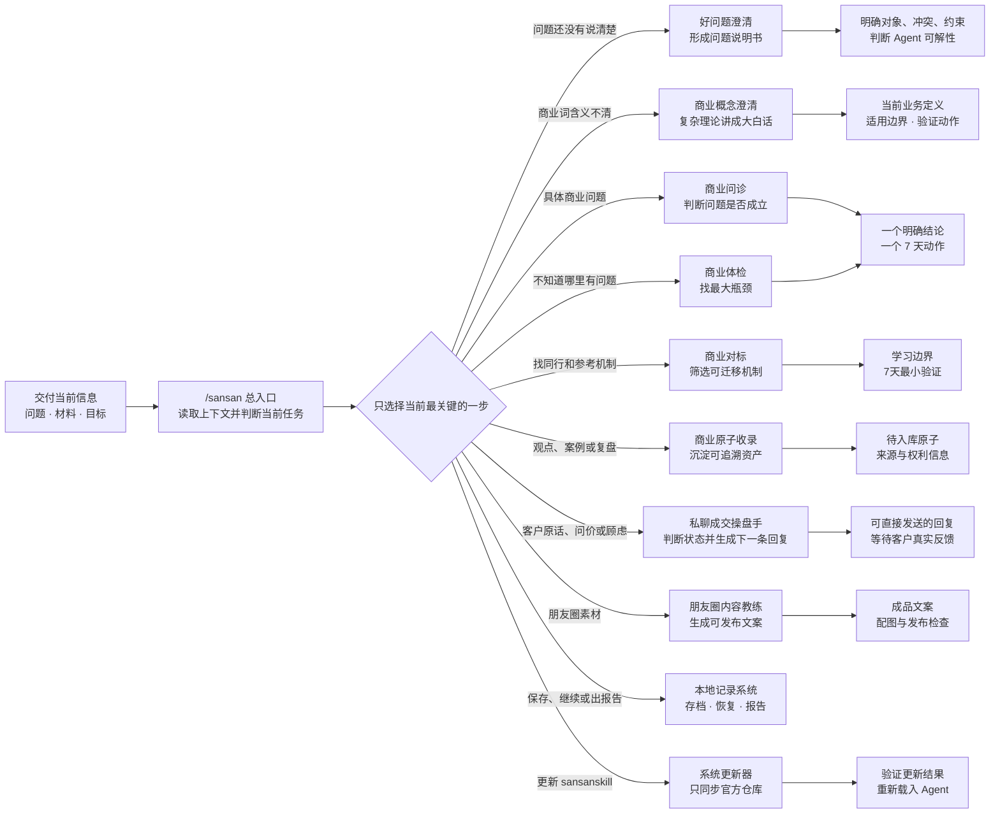

# sansanskill

> 面向已有真实业务或正在验证首单的创业者的中文 AI Skills 工具箱。把商业概念澄清、商业诊断、商业对标、私聊成交、AI 业务落地和朋友圈内容问题交给 Agent，获得清晰判断和可以立即执行的下一步。


**支持：豆包、WorkBuddy、Claude Code、Codex，以及其他支持标准 Skills 的 Agent。**

sansanskill 由 [三三](https://github.com/sansan19900801) 创建。仓库已将 40 个原创朋友圈案例和 4 个可追溯商业原子整理为 44 条结构化知识原子，并把相关方法与三三的业务判断规则沉淀为 11 个可以直接调用的 Skills。

[快速开始](#快速开始) · [安装](#安装) · [能力一览](#能力一览) · [知识库与本地记录](#知识库与本地记录) · [更新日志](https://github.com/sansan19900801/sansanskill/releases)

## 三三 AI 商业动态路由

你不需要记住每个 Skill 的名字。只要把当前问题、材料和目标交给总入口，它会判断现在最该进入哪个专项能力。



路由遵循两个原则：**每次只处理当前最关键的一步；下一步由真实结果和用户反馈决定。**

## 解决什么问题

| 你现在的情况 | 系统会怎么处理 | 推荐入口 |
| --- | --- | --- |
| 有产品、有业务，但不知道先解决获客、成交还是交付 | 扫描八个商业系统，找出一个最大瓶颈、能力缺口和 7 天动作 | `/sansan` |
| 只有一个模糊困惑，不知道问题该怎么描述 | 明确对象、目标、核心冲突、约束和反馈入口，形成问题说明书 | `sansan-good-question` |
| 被个人IP、定位、赛道、精准客户、高客单等商业词困住 | 用维特根斯坦、奥派经济学和七张表讲成大白话，明确当前业务含义与边界 | `sansan-business-concept` |
| 带着一个商业判断、选择或困惑，希望有人帮你判断 | 检查问题定义、隐藏前提、事实证据、因果链和推翻条件 | `sansan-business-diagnosis` |
| 会使用 AI，但没有产生明显业务结果 | 判断问题出在商业标准、素材数据、业务流程还是 AI 使用方式 | `sansan-business-diagnosis` |
| 已经知道要改善什么，想找同行、产品或商业模式参考 | 核验证据，拆解内容、产品、获客、成交、交付或商业模式中的可迁移机制 | `sansan-benchmark` |
| 想把真实观点、案例、诊断或业务复盘沉淀下来 | 补齐来源、权限、适用条件、反例边界和证据等级 | `sansan-business-diagnosis` |
| 有客户反馈、收款、咨询、生活或业务观点素材 | 路由为反馈圈、收款圈、咨询圈、生活圈或三重天朋友圈 | `sansan-wechat-moments-coach` |
| 有具体客户原话、聊天记录或截图，不知道下一句怎么回 | 先回应客户当前问题，再按私聊成交八步曲与咨询六问判断下一步 | `sansan-private-sales-closer` |
| 客户问价格、说贵、考虑一下、看后不回或明确想买 | 生成一条自然、真实、可直接发送的回复，不编造价格、案例和效果 | `sansan-private-sales-closer` |
| 想把本次诊断留到下次继续 | 只在明确授权后保存本地诊断状态 | `sansan-save` |
| 想接着上次诊断继续 | 恢复历史状态，先核对实际变化再决定下一步 | `sansan-restore` |
| 想把一次或多次诊断整理成报告 | 生成内部完整版或脱敏分享版 Markdown 报告 | `sansan-report` |
| 想把 sansanskill 更新到最新版 | 只同步三三官方仓库，验证新入口并保护其他 Skill 与业务资料 | `sansan-update` |
| 不知道应该用哪个 Skill | 直接描述最近正在推进的一件事，由总入口选择当前一步 | `/sansan` |

## 快速开始

安装完成后，直接在 Agent 中输入：

```text
/sansan
```

也可以在后面直接说出你的真实问题：

```text
/sansan 我已经有产品也成交过，但不知道现在应该先解决获客、成交还是交付。
```

你只需要记住 `/sansan`。商业概念澄清、问题澄清、商业诊断、商业对标、朋友圈内容、本地存档、状态恢复、阶段报告和系统更新都由总入口判断和路由。

## 能力一览

| Skill | 核心能力 | 典型结果 |
| --- | --- | --- |
| `sansan` | 唯一总入口；读取完整上下文，识别当前最关键任务，路由到已经上线的专项 Skill | 一个明确入口和当前下一步 |
| `sansan-business-concept` | 用维特根斯坦、奥派经济学和七张表澄清商业概念，并翻译成大白话 | 当前业务定义、适用边界和一个验证动作 |
| `sansan-good-question` | 把模糊困惑改写成可推理、可批评、可验证的问题说明书，并判断 Agent 可解性 | 问题清晰度、问题说明书和一个最小下一步 |
| `sansan-business-diagnosis` | 商业问诊、八系统体检、最大瓶颈诊断、AI 介入判断与商业原子收录 | 事实判断、瓶颈、能力缺口、7 天动作或待入库原子 |
| `sansan-benchmark` | 内容、产品、获客、成交、交付和商业模式六类商业对标 | 证据状态、可迁移机制、不可照搬边界和7天验证动作 |
| `sansan-private-sales-closer` | 按私聊成交八步曲×咨询六问处理客户原话、问价、顾虑、跟进、复盘和流程定制 | 一条可直接发送的回复，或有证据的成交判断与下一步 |
| `sansan-wechat-moments-coach` | 根据真实文字、截图和图片生成五类朋友圈 | 可发布文案、评论区、配图建议和真实性检查 |
| `sansan-save` | 明确授权后保存已确认的商业诊断状态 | 本地 Markdown 存档与可追溯下一步 |
| `sansan-restore` | 恢复历史诊断并核对实际变化 | 上次状态、变化检查和继续入口 |
| `sansan-report` | 合并正式存档，生成单次或阶段报告 | 内部完整版或脱敏分享版 Markdown 报告 |
| `sansan-update` | 只同步三三官方仓库，清理作废入口并验证更新结果 | 已更新的官方 Skill 与真实验证结果 |

### 商业诊断覆盖的八个系统

1. 客户资产
2. 产品结构
3. 内容与信任
4. 获客
5. 成交路径
6. 交付与复购
7. AI 增长效率
8. 创始人战略

诊断不会平均输出八项建议，而是收敛到当前一个最大瓶颈，并说明为什么不是其他显眼问题。

### 朋友圈的五个入口

- **反馈圈**：客户使用前的痛苦状态、使用后的真实变化与反馈证据；
- **收款圈**：客户是谁、为什么购买，以及真实付款或报名证据；
- **咨询圈**：客户是谁、为什么主动咨询，以及真实聊天证据；
- **生活圈**：什么时间、什么地点、和谁发生了什么真实事件；
- **三重天朋友圈**：观点、方法、产品发售、圈层背书和其他业务事件。

反馈圈、收款圈、咨询圈和生活圈必须提供本次事件对应的截图或图片；三重天朋友圈不强制提供图片。

## 安装

### 豆包、WorkBuddy、Codex 及其他支持 Skills 的 Agent

安装全部三三 Skills：

```bash
npx -y skills add sansan19900801/sansanskill -g --all
```

- `-g`：安装到当前用户的全局 Skill 目录；
- `--all`：安装仓库中的全部 Skill，并自动选择安装器能够识别的 Agent；
- 需要本机已经安装 Node.js；
- 安装器只负责 Skill 发现与安装，不会自动获得你的微信、客户资料或其他私人数据。

> WorkBuddy 安装结束时，如果提示的操作明确是“清理安装临时文件”，可以点击允许，不影响 Skill 使用。如果页面显示某个 Skill 为 `High Risk`，请先打开对应安全报告核对具体原因，不要因为本说明直接忽略风险。

安装或更新后，重新打开当前 Agent，再输入：

```text
/sansan
```

> 本仓库使用标准 `SKILL.md` 结构。公开安装的商业原子收录能力只生成经过来源、权利与安全检查的待入库内容，不会根据用户材料自动运行命令或写入官方仓库。仓库维护者需要另行审查并执行维护流程。

新增或修改 Skill 时，先执行 [Skill 发布安全规则](SECURITY.md)。本地安全门和 GitHub 自动扫描发现高风险时，版本不得作为可发布版本；不得通过改名或替换词汇规避审计。

## 更新

已安装 sansanskill 时，直接对当前 Agent 说：

```text
更新 sansanskill
```

它会同步官方 sansanskill，不会修改你的 Obsidian、聊天记录、客户资料和其他来源的 Skill。版本变化见 [GitHub Releases](https://github.com/sansan19900801/sansanskill/releases)。

## sansanskill 怎样工作

```text
真实业务问题、目标或材料
    ↓
/sansan 读取上下文并选择当前入口
    ↓
一个 Skill 完成诊断、对标、内容或系统任务
    ↓
补充执行结果与反馈，再决定下一步
```

sansanskill 的重点是推进眼前真实的业务任务。它会先处理当前最有价值的结点，再根据实际结果衔接后续工作；不会为了展示功能，一次调用一堆不相关的 Skills。

## 知识库与本地记录

仓库公开了 **44 条结构化知识原子**和按 Skill 整理的 **6 个知识包**。

- 想查看数据范围和字段，阅读 [原子库说明](知识库/原子库/原子库说明.md)。
- 想查看朋友圈案例，浏览 [朋友圈案例原子库](知识库/原子库/cases.jsonl)。
- 想查看商业原则与真实业务案例，浏览 [商业原子库](知识库/原子库/business-atoms.jsonl)。
- 想了解各项能力使用的案例和方法，浏览 [Skill 知识包](知识库/Skill知识包/)。

当前知识库包含 40 个三三原创朋友圈案例和 4 个可追溯商业原子。新增内容会经过来源、权利和适用边界检查，再进入公开知识库。

想跨对话保留工作，可以使用：

- `/sansan-save`：明确授权后保存本次商业诊断；
- `/sansan-restore`：恢复上次状态，核对变化后继续；
- `/sansan-report`：把一份或多份正式存档整理成报告。

本地数据默认保存在用户机器的 `~/.sansan/`。系统不会自动保存聊天；只有用户明确说“保存这次诊断”才写入，也不会把本地记录上传 GitHub。

## 项目结构

```text
sources/朋友圈案例原文/          人工维护的朋友圈案例真源
sources/商业原子原文/            人工维护的商业观点、案例、实验与外部模型真源
知识库/原子库/                  朋友圈案例原子库与商业原子库
知识库/Skill知识包/             由原子库生成的朋友圈与商业诊断知识包
skills/                         可安装的 Skill
research/dbskill/               对 dbskill 的证据化产品与能力解剖
architecture/                   三三原创系统蓝图、路由和产品边界
tests/                          路由、商业诊断与本地状态测试
tools/                          原子化、校验、构建和新增案例工具
dist/                           本地构建的发布包，不提交 Git
```

本 GitHub 仓库是三三 Skill 产品的唯一真源。Obsidian、Agent 安装目录和本地导出文件都不是这套 Skill 的真源。详细边界见 [SOURCE_OF_TRUTH.md](SOURCE_OF_TRUTH.md)。

## 作者与支持

作者：[@sansan19900801](https://github.com/sansan19900801)

如需加入付费答疑群，可扫码或打开 [答疑群说明](docs/support.md)。


## 许可证

本项目采用 [CC BY-NC 4.0](LICENSE) 许可证。

- 个人使用、学习、研究与非商业项目可以直接使用。
- 公开发布衍生作品时，请注明来源。
- 商业用途需要单独授权，请联系作者。

## 开源与使用边界

- 免费 Skill 负责标准化、可重复、可自助完成的任务；
- 不通过故意隐藏常识制造付费，也不在正常输出中植入隐蔽广告；
- 案例只作结构与判断参考，不能编造使用者事实；
- 当前 40 个案例已由三三确认为原创并可公开发布；
- 外部方法论必须保留作者与来源，不能写成三三原创；
- 商业原子只有在获得所有权或明确授权、且允许公开时，才会进入公开 Skill；
- 任何历史产品、价格和结果数据都不能自动当成当前产品口径。
