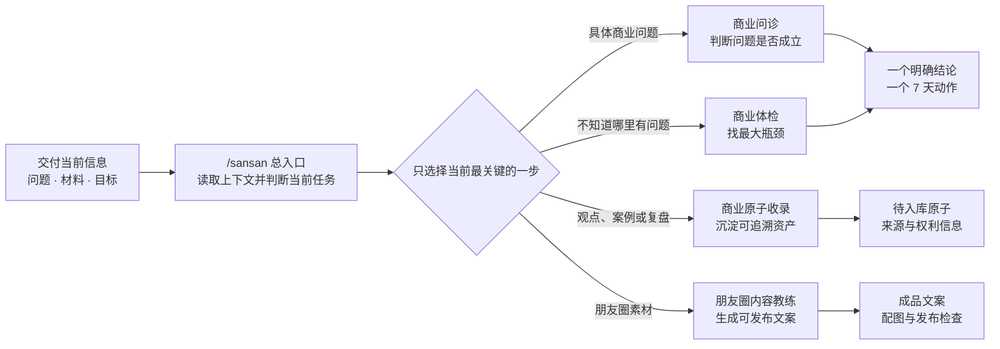

# sansanskill

> 面向已有真实业务或正在验证首单的创业者的中文 AI 商业 Skills 系统。把商业诊断、AI 业务落地和朋友圈内容问题交给 Agent，获得清晰判断与可以立即执行的下一步。


**支持：豆包、WorkBuddy、Claude Code、Codex，以及其他支持标准 Skills 的 Agent。**

sansanskill 由三三创建。当前系统把 40 个原创朋友圈案例、4 个可追溯商业原子和三三的业务判断规则，沉淀为 3 个可以直接调用的 Skills。

[快速开始](#快速开始) · [解决什么问题](#解决什么问题) · [能力一览](#能力一览) · [安装](#安装) · [工作方式](#工作方式) · [知识资产](#知识资产) · [维护与更新](#维护与更新)

## 三三 AI 商业动态路由

你不需要记住每个 Skill 的名字。只要把当前问题、材料和目标交给总入口，它会判断现在最该进入哪个专项能力。



路由遵循两个原则：**每次只处理当前最关键的一步；下一步由真实结果和用户反馈决定。**

## 解决什么问题

| 你现在的情况 | 系统会怎么处理 | 推荐入口 |
| --- | --- | --- |
| 有产品、有业务，但不知道先解决获客、成交还是交付 | 扫描八个商业系统，找出一个最大瓶颈、能力缺口和 7 天动作 | `/sansan` |
| 带着一个商业判断、选择或困惑，希望有人帮你判断 | 检查问题定义、隐藏前提、事实证据、因果链和推翻条件 | `sansan-business-diagnosis` |
| 会使用 AI，但没有产生明显业务结果 | 判断问题出在商业标准、素材数据、业务流程还是 AI 使用方式 | `sansan-business-diagnosis` |
| 想把真实观点、案例、诊断或业务复盘沉淀下来 | 补齐来源、权限、适用条件、反例边界和证据等级 | `sansan-business-diagnosis` |
| 有客户反馈、收款、咨询、生活或业务观点素材 | 路由为反馈圈、收款圈、咨询圈、生活圈或三重天朋友圈 | `sansan-wechat-moments-coach` |
| 不知道应该用哪个 Skill | 直接描述最近正在推进的一件事，由总入口选择当前一步 | `/sansan` |

## 快速开始

安装完成后，直接在 Agent 中输入：

```text
/sansan
```

也可以在后面直接说出你的真实问题：

```text
/sansan 我已经有产品也成交过，但不知道现在应该先解决获客、成交还是交付。
```

你只需要记住 `/sansan`。商业诊断、商业体检、商业原子收录和朋友圈内容任务都由总入口自动判断和路由。

## 能力一览

| Skill | 核心能力 | 典型结果 |
| --- | --- | --- |
| `sansan` | 唯一总入口；读取完整上下文，识别当前最关键任务，路由到已经上线的专项 Skill | 一个明确入口和当前下一步 |
| `sansan-business-diagnosis` | 商业问诊、八系统体检、最大瓶颈诊断、AI 介入判断与商业原子收录 | 事实判断、瓶颈、能力缺口、7 天动作或待入库原子 |
| `sansan-wechat-moments-coach` | 根据真实文字、截图和图片生成五类朋友圈 | 可发布文案、评论区、配图建议和真实性检查 |

### 商业诊断覆盖的八个系统

1. 客户资产
2. 产品结构
3. 内容与信任
4. 获客
5. 成交路径
6. 交付与复购
7. AI 增长效率
8. 创始人战略

诊断不会平均输出八项建议，而是收敛到当前一个最大瓶颈，并说明为什么不是其他显眼问题。

### 朋友圈的五个入口

- **反馈圈**：客户使用前的痛苦状态、使用后的真实变化与反馈证据；
- **收款圈**：客户是谁、为什么购买，以及真实付款或报名证据；
- **咨询圈**：客户是谁、为什么主动咨询，以及真实聊天证据；
- **生活圈**：什么时间、什么地点、和谁发生了什么真实事件；
- **三重天朋友圈**：观点、方法、产品发售、圈层背书和其他业务事件。

反馈圈、收款圈、咨询圈和生活圈必须提供本次事件对应的截图或图片；三重天朋友圈不强制提供图片。

## 安装

### 豆包、WorkBuddy、Codex 及其他支持 Skills 的 Agent

安装全部三三 Skills：

```bash
npx -y skills add sansan19900801/sansanskill -g --all
```

如果你安装过 v0.3.0 或更早版本，先移除旧的长入口，再重新安装：

```bash
npx -y skills remove sansan-business-router -g -y
npx -y skills add sansan19900801/sansanskill -g --all
```

- `-g`：安装到当前用户的全局 Skill 目录；
- `--all`：安装仓库中的全部 Skill，并自动选择安装器能够识别的 Agent；
- 需要本机已经安装 Node.js；
- 安装器只负责 Skill 发现与安装，不会自动获得你的微信、客户资料或其他私人数据。

只查看仓库中有哪些可安装 Skill，不执行安装：

```bash
npx -y skills add sansan19900801/sansanskill -l
```

只安装某一个 Skill：

```bash
npx -y skills add sansan19900801/sansanskill -g --skill sansan-business-diagnosis -y
```

更新三三的三个 Skill，不更新其他来源的 Skill：

```bash
npx -y skills update sansan sansan-business-diagnosis sansan-wechat-moments-coach -g -y
```

安装或更新后，重新打开当前 Agent，再输入：

```text
/sansan
```

> 本仓库使用标准 `SKILL.md` 结构。能否读取本地文件、运行构建脚本或直接写入原子库，取决于具体 Agent 提供的权限。没有文件权限时，Skill 只会生成待入库内容，不会声称已经保存。

## 工作方式

### 1. 先读取真实上下文

系统优先复用你已经提供的产品、客户、成交、渠道、交付、目标和材料，不让你重复填写同一份信息。信息不足时，一次只问一个会改变判断的问题。

### 2. 总入口只负责路由

`sansan` 不冒充万能专家。它只判断当前最值得推进的任务，并把完整上下文交给已经通过校验的专项 Skill。

### 3. 专项 Skill 完成当前任务

商业诊断负责判断、收敛和行动；朋友圈教练负责把真实素材写成内容。尚未上线的能力会明确标记，不会伪装成已经可用的工具。

### 4. 用结果决定下一步

系统不会为了展示能力强行串联多个 Skill。发布、验证或执行后，再根据真实反馈决定是否进入下一项任务。

## 知识资产

### 40 个原创朋友圈案例

| 原始分类 | 数量 | 对外路由 |
| --- | ---: | --- |
| 反馈圈 | 13 | 反馈圈 |
| 收款圈 | 7 | 收款圈 |
| 咨询圈 | 1 | 咨询圈 |
| 生活圈 | 4 | 生活圈 |
| 认知圈 | 11 | 三重天朋友圈 |
| 方法圈 | 2 | 三重天朋友圈 |
| 发售圈 | 1 | 三重天朋友圈 |
| 圈层背书圈 | 1 | 三重天朋友圈 |

案例用于匹配结构、证据类型、标题方式和表达节奏，不能把案例中的人物、金额、产品、客户原话和结果当作使用者本人的事实。

### 4 个可追溯商业原子

- 2 条三三商业原则；
- 2 条三三真实业务案例；
- 每条都记录原始来源、适用条件、不适用条件、证据等级和公开权限；
- 后续可继续收录视频号、抖音、小红书、公众号、课程、客户诊断和业务实验。

新增材料时只需要说“把这条做成商业原子”，系统会一次一个问题补齐来源与权利信息。

## 项目结构

```text
sources/朋友圈案例原文/          人工维护的朋友圈案例真源
sources/商业原子原文/            人工维护的商业观点、案例、实验与外部模型真源
知识库/原子库/                  朋友圈案例原子库与商业原子库
知识库/Skill知识包/             由原子库生成的朋友圈与商业诊断知识包
skills/                         可安装的 Skill
research/dbskill/               对 dbskill 的证据化产品与能力解剖
architecture/                   三三原创系统蓝图、路由和产品边界
tests/                          路由与商业诊断测试案例
tools/                          原子化、校验、构建和新增案例工具
dist/                           本地构建的发布包，不提交 Git
```

本 GitHub 仓库是三三 Skill 产品的唯一真源。Obsidian、Agent 安装目录和本地导出文件都不是这套 Skill 的真源。详细边界见 [SOURCE_OF_TRUTH.md](SOURCE_OF_TRUTH.md)。

## 维护与更新

新增朋友圈案例时，优先运行：

```bash
python3 tools/add-case.py --type 反馈圈 --title "案例标题"
```

新增商业原子时，优先运行：

```bash
python3 tools/add-business-atom.py --type principle --title "原子标题"
```

填写真源文件后运行：

```bash
./tools/build-release.sh
```

构建流程会重新生成原子库和知识包，检查数量、编号、来源、权利状态和路由，校验三个已上线 Skill，并生成独立安装包与系统整包。

## 开源与使用边界

- 免费 Skill 负责标准化、可重复、可自助完成的任务；
- 不通过故意隐藏常识制造付费，也不在正常输出中植入隐蔽广告；
- 案例只作结构与判断参考，不能编造使用者事实；
- 当前 40 个案例已由三三确认为原创并可公开发布；
- 外部方法论必须保留作者与来源，不能写成三三原创；
- 商业原子只有在获得所有权或明确授权、且允许公开时，才会进入公开 Skill；
- 任何历史产品、价格和结果数据都不能自动当成当前产品口径。

当前仓库尚未发布统一许可证文件。未经明确许可，请勿将本仓库内容用于二次商业分发。
